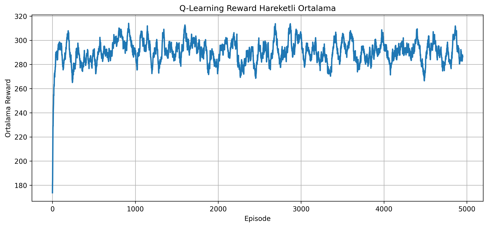
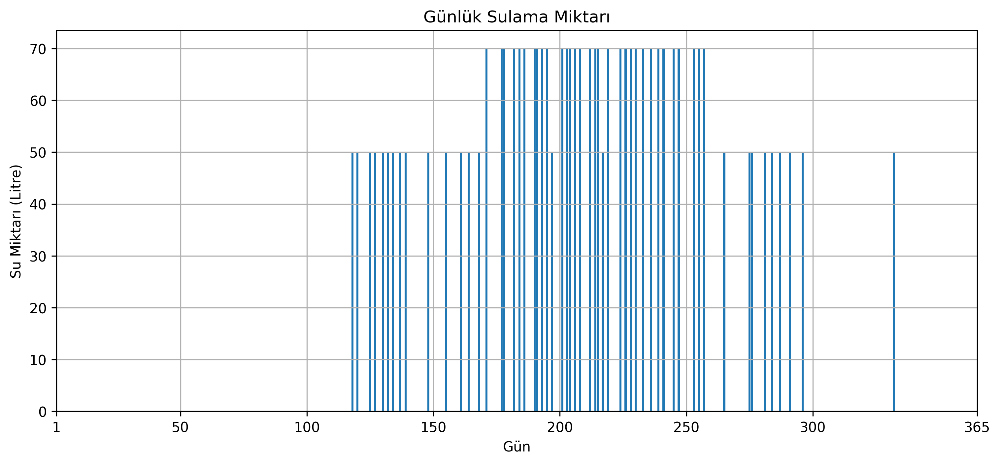
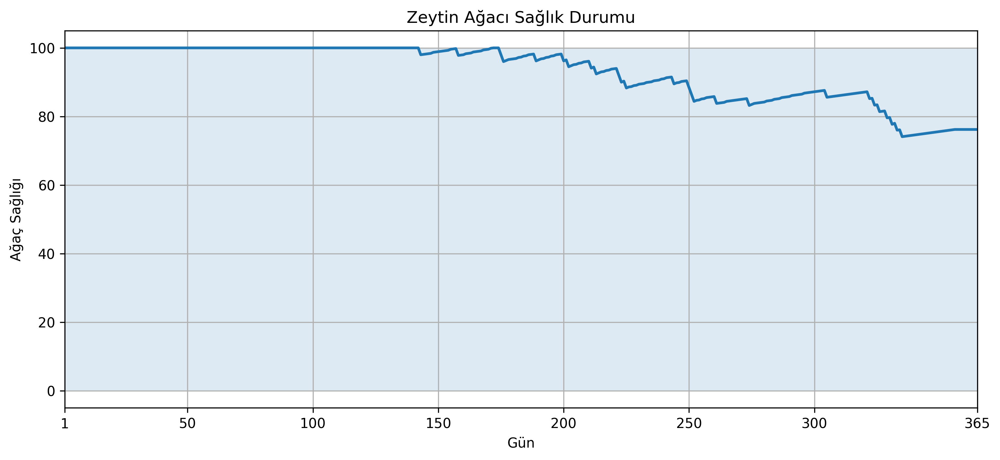
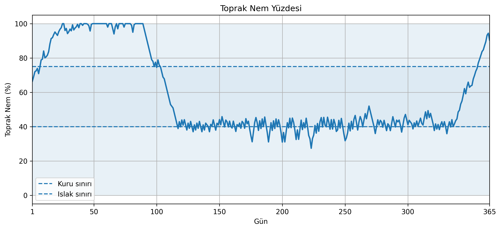

# AKILLI SULAMA SİSTEMİ 
Bu projede, zeytin ağacı için geliştirilen yapay zekâ destekli bir akıllı sulama sistemi tasarlanmıştır. Sistem, çevresel sensör verilerini analiz ederek sulama kararlarını otomatik şekilde verebilmektedir. Çalışmada Reinforcement Learning (RL) yöntemlerinden biri olan Q-Learning algoritması kullanılmıştır.

Geleneksel sulama sistemlerinde sulama işlemleri genellikle sabit zaman aralıklarıyla veya manuel kontrol ile gerçekleştirilmektedir. Bu durum gereksiz su tüketimine, enerji kaybına ve bitki sağlığının olumsuz etkilenmesine neden olabilmektedir. Bu projede geliştirilen sistem ise çevresel koşulları değerlendirerek yalnızca gerekli durumlarda sulama yapmayı öğrenmektedir.

Sistem; toprak nemi, hava durumu, sıcaklık, rüzgar hızı ve atmosfer basıncı gibi çevresel parametreleri dikkate alarak en uygun sulama kararını vermeyi amaçlamaktadır. Böylece hem su tasarrufu sağlanmakta hem de bitkinin sağlıklı kalması hedeflenmektedir.


# Agent (Ajan) ve Environment (Ortam) Yapısı

Bu çalışmada Reinforcement Learning yapısına uygun olarak bir agent–environment modeli oluşturulmuştur.

Agent (ajan), akıllı sulama sisteminin karar verme mekanizmasını temsil etmektedir. Agent’ın görevi, çevresel sensör verilerini analiz ederek sulama işleminin gerçekleştirilip gerçekleştirilmeyeceğine karar vermektir.

Environment (ortam) ise zeytin ağacının bulunduğu tarımsal alanı temsil etmektedir. Ortam içerisinde aşağıdaki çevresel parametreler bulunmaktadır:

| Çevresel Parametre | Açıklama |
| ------------------ | -------- |
| Toprak nemi | Toprağın mevcut nem seviyesini temsil eder |
| Hava durumu | Yağmurlu, güneşli, bulutlu veya karlı hava bilgisini temsil eder |
| Hava sıcaklığı | Ortam sıcaklık durumunu temsil eder |
| Rüzgar hızı | Buharlaşmayı etkileyen rüzgar seviyesini temsil eder |
| Atmosfer basıncı | Hava basınç durumunu temsil eder |
| Su deposu seviyesi | Depoda bulunan mevcut su miktarını temsil eder |

Agent, environment içerisindeki mevcut durumu gözlemleyerek bir aksiyon seçmektedir. Seçilen aksiyona bağlı olarak environment yeni bir duruma geçmekte ve agent’a ödül (reward) veya ceza değeri döndürmektedir.

Bu etkileşim süreci sayesinde sistem zamanla en uygun sulama stratejisini öğrenebilmektedir.

# State (Durum) Yapısı

Q-Learning algoritmasının doğru karar verebilmesi için sistemin mevcut çevresel koşullarını temsil eden bir state (durum) yapısı oluşturulmuştur.

Bu çalışmada kullanılan state yapısı; toprağın mevcut nem durumunu, atmosfer koşullarını ve çevresel etkileri temsil eden sensör verilerinden meydana gelmektedir.

Sistemde kullanılan durum vektörü aşağıdaki bileşenlerden oluşmaktadır:

```python
state = [
    soil_moisture,     # Toprağın mevcut nem durumu
    weather,           # Hava durumu bilgisi
    air_temperature,   # Ortam sıcaklığı
    wind_speed,        # Rüzgar hızı
    pressure           # Atmosfer basıncı
]
```

State yapısında kullanılan parametreler aşağıdaki gibidir:

| Parametre      | Durumlar |
| -------------- | --------------------------------------------- |
| Toprak Nemi    | Kuru (%0–39), Nemli (%40–75), Islak (%76–100) |
| Hava Durumu    | Yağmurlu, Güneşli, Bulutlu, Karlı |
| Hava Sıcaklığı | Düşük (≤10°C), Orta (11–25°C), Yüksek (>25°C) |
| Rüzgar Hızı    | Düşük (<10 km/h), Orta (10–25 km/h), Yüksek (>25 km/h) |
| Hava Basıncı   | Düşük (<1000 hPa), Normal (1000–1020 hPa), Yüksek (>1020 hPa) |

Gerçek sensör verileri sürekli değerler içerdiğinden dolayı Q-Learning algoritmasının daha kararlı çalışabilmesi amacıyla ayrıklaştırma (discretization) işlemi uygulanmıştır.

Örneğin:

- Toprak nemi %40’ın altındaysa “Kuru”
- %40–75 aralığındaysa “Nemli”
- %75’in üzerindeyse “Islak”

olarak sınıflandırılmıştır.

Benzer şekilde sıcaklık, rüzgar ve basınç değerleri de düşük, orta ve yüksek gibi ayrık durumlara dönüştürülmüştür.

Bu yaklaşım sayesinde:

- state uzayı sadeleştirilmiş,
- öğrenme süreci hızlandırılmış,
- Q-table boyutu kontrol altında tutulmuş,
- sistemin daha stabil öğrenmesi sağlanmıştır.

# Action (Aksiyon) Yapısı

Q-Learning algoritmasında agent, mevcut state bilgilerine göre belirli bir aksiyon seçerek environment üzerinde etkide bulunmaktadır.

Bu çalışmada sistemin gerçekleştirebileceği iki temel aksiyon tanımlanmıştır:

```python
actions = [
    "Sulama kapalı",
    "Sulama açık"
]
```

Aksiyonların açıklamaları aşağıdaki gibidir:

| Aksiyon | Açıklama |
| --- | --- |
| Sulama kapalı | Sistemin sulama işlemini gerçekleştirmediği durumu temsil eder |
| Sulama açık | Sistemin sulama işlemini aktif hale getirdiği durumu temsil eder |

Agent, bulunduğu çevresel koşullara göre en uygun aksiyonu seçmeye çalışmaktadır.

Örneğin:

- Toprak kuruysa sulama açılması,
- Toprak zaten ıslaksa sulamanın kapalı tutulması,
- Yağmurlu havalarda gereksiz sulama yapılmaması

beklenen doğru davranışlar arasında yer almaktadır.

Q-Learning algoritması eğitim süreci boyunca hangi state durumunda hangi aksiyonun daha avantajlı olduğunu öğrenerek Q-table değerlerini güncellemektedir.

# Q-Table Yapısı

Q-Learning algoritmasının öğrenme mekanizması Q-table yapısı üzerine kurulmuştur. Q-table, her state–action kombinasyonu için elde edilen ödül değerlerini saklayan öğrenme tablosudur.

Bu çalışmada oluşturulan Q-table yapısı aşağıdaki gibidir:

```python
Q = np.zeros((3, 4, 3, 3, 3, 2))
```

Q-table boyutları kullanılan state ve action sayılarına göre oluşturulmuştur.

| Boyut | Açıklama |
| --- | --- |
| 3 | Toprak nem durumu |
| 4 | Hava durumu |
| 3 | Hava sıcaklığı durumu |
| 3 | Rüzgar durumu |
| 3 | Atmosfer basıncı durumu |
| 2 | Aksiyon sayısı |

Bu yapı sayesinde sistem:

- mevcut çevresel durumu analiz etmekte,
- her durum için uygun aksiyon değerlerini saklamakta,
- geçmiş deneyimlerden öğrenmekte,
- zamanla daha doğru sulama kararları verebilmektedir.

Q-table başlangıçta sıfır değerleri ile oluşturulmuştur. Eğitim süreci boyunca doğru kararların Q değerleri artırılırken yanlış kararların değerleri azaltılmaktadır.

Agent, her state için en yüksek Q değerine sahip aksiyonu seçerek optimum sulama stratejisini öğrenmektedir.

# Reward (Ödül) Mekanizması

Q-Learning algoritmasının öğrenme gerçekleştirebilmesi için agent’ın gerçekleştirdiği aksiyonların değerlendirilmesi gerekmektedir. Bu amaçla sistem içerisinde bir ödül–ceza (reward) mekanizması tasarlanmıştır.

Reward mekanizmasının temel amacı, agent’ın doğru sulama davranışlarını öğrenmesini sağlamaktır. Doğru kararlar pozitif ödül ile desteklenirken yanlış kararlar negatif ceza ile değerlendirilmektedir.

Örneğin:

- Toprak kuru olduğunda sulama yapılması,
- Sıcak ve güneşli havalarda uygun sulama gerçekleştirilmesi,
- Gereksiz su tüketiminin önlenmesi

pozitif davranış olarak kabul edilmektedir.

Buna karşılık:

- Toprak kuru olduğu halde sulama yapılmaması,
- Toprak zaten ıslakken tekrar sulama yapılması,
- Yağmurlu veya karlı havalarda sulama gerçekleştirilmesi,
- Yüksek rüzgar altında sulama yapılması

negatif davranış olarak değerlendirilmektedir.

Sistemde kullanılan reward mekanizmasına ait örnek kod yapısı aşağıda verilmiştir:

```python
def get_reward(soil, weather, air_temp, wind, pressure, action):

    # Toprak kuruysa sulama yapmak doğru karardır
    if soil == 0 and action == 1:
        reward = 20

        # Sıcak ve güneşli hava ekstra sulama ihtiyacı oluşturur
        if air_temp == 2 and weather == 1:
            reward += 10

        # Yüksek basınç açık hava koşullarını temsil eder
        if pressure == 2:
            reward += 5

        # Güçlü rüzgar sulama verimini düşürür
        if wind == 2:
            reward -= 8

        return reward

    # Toprak kuru olduğu halde sulama yapılmazsa ceza verilir
    if soil == 0 and action == 0:
        return -50
```

Bu yapı sayesinde agent, eğitim süreci boyunca hangi durumlarda sulama yapılmasının daha avantajlı olduğunu öğrenmektedir.

Reward mekanizması aynı zamanda:

- su tasarrufunun sağlanması,
- gereksiz sulamanın önlenmesi,
- bitki sağlığının korunması,
- çevresel koşullara uygun karar verilmesi

amaçlarına yönelik olarak tasarlanmıştır.

# Environment Transition (Ortam Geçişi)

Q-Learning yapısında agent tarafından gerçekleştirilen her aksiyon sonrasında environment yeni bir duruma geçmektedir. Bu geçiş mekanizması, gerçek çevre koşullarını simüle edebilmek amacıyla tasarlanmıştır.

Sistemde gerçekleştirilen aksiyonlara bağlı olarak çevresel parametreler değişebilmektedir.

Örneğin:

- Sulama yapılması durumunda toprak nem seviyesi artmaktadır.
- Sulama yapılmaması durumunda sıcaklık ve buharlaşma etkisiyle toprak kuruyabilmektedir.
- Yüksek rüzgar seviyesi buharlaşmayı artırmaktadır.
- Yağmurlu hava koşulları toprağın doğal olarak nemlenmesini sağlamaktadır.

Bu yapı sayesinde environment dinamik bir yapıya sahip olmakta ve agent farklı çevresel koşullarda karar vermeyi öğrenebilmektedir.

# Q-Learning Eğitimi

Sistem toplam 5000 bölüm (episode) boyunca eğitilmiştir.

Kullanılan temel hiperparametreler:

| Parametre                 | Değer |
| ------------------------- | ----- |
| Öğrenme oranı (alpha)     | 0.1   |
| İndirim katsayısı (gamma) | 0.9   |
| Keşif oranı (epsilon)     | 0.2   |
| Episode sayısı            | 5000  |

Q-Learning güncelleme denklemi:

```text
Q(s,a) ← Q(s,a) + α [ r + γ max Q(s',a') - Q(s,a) ]
```

Bu denklem sayesinde sistem geçmiş deneyimlerinden öğrenerek gelecekte daha doğru kararlar verebilmektedir.

# Mevsimsel Veri Üretimi

Sistem 365 günlük çevresel veri üretmektedir.

Yıl dört farklı mevsime ayrılmıştır:

| Mevsim   | Özellik                             |
| -------- | ----------------------------------- |
| Kış      | Daha düşük sıcaklık ve yüksek yağış |
| İlkbahar | Orta sıcaklık ve değişken hava      |
| Yaz      | Yüksek sıcaklık ve güneşli hava     |
| Sonbahar | Yağışlı ve serin hava               |

Bu yaklaşım sayesinde sistem gerçek çevresel koşullara daha yakın çalışmaktadır.

# Su Deposu Mekanizması

Sistemde yağmur suyu toplama mantığı da bulunmaktadır.

* Yağmurlu günlerde depo seviyesi artmaktadır.
* Karlı günlerde daha düşük miktarda su eklenmektedir.
* Sulama yapıldığında depo seviyesi azalmaktadır.

Bu mekanizma su tasarrufunu desteklemek amacıyla geliştirilmiştir.

# Ağaç Sağlığı Modeli

Sistem içerisinde zeytin ağacının sağlık durumu da takip edilmektedir.

Başlangıç sağlık değeri:

```python
tree_health = 100
```

Yanlış sulama kararları sağlık değerini düşürmektedir:

* Susuz kalma
* Aşırı sulama
* Depoda su bulunmaması

Doğru sulama kararları ise ağacın sağlığını korumaktadır.

Bu yapı sayesinde sistem yalnızca su tüketimini değil aynı zamanda bitki sağlığını da optimize etmeye çalışmaktadır.

# Kullanılan Kütüphaneler

Projede aşağıdaki Python kütüphaneleri kullanılmıştır:

| Kütüphane | Kullanım Amacı |
| --- | --- |
| NumPy | Matematiksel işlemler ve Q-table oluşturma |
| random | Rastgele çevresel veri üretimi |
| Matplotlib | Grafik çizimleri |
| FuncAnimation | GIF animasyonu oluşturma |
| PillowWriter | GIF kaydetme işlemleri |


# Grafik Çıktıları

Sistem eğitimi ve 1 yıllık simülasyon süreci tamamlandıktan sonra performans analizlerinin gerçekleştirilebilmesi amacıyla çeşitli grafik çıktıları oluşturulmuştur.

Bu grafikler sayesinde:

- Q-Learning algoritmasının öğrenme performansı,
- sulama miktarındaki değişimler,
- toprak nem seviyeleri,
- bitki sağlığı durumu

görsel olarak analiz edilebilmektedir.

Sistemde oluşturulan grafikler aşağıdaki gibidir:

| Grafik | Açıklama |
| --- | --- |
| Reward Hareketli Ortalama Grafiği | Q-Learning algoritmasının öğrenme performansını göstermektedir |
| Günlük Sulama Miktarı Grafiği | Günlük kullanılan su miktarını göstermektedir |
| Ağaç Sağlığı Grafiği | Zeytin ağacının yıl içerisindeki sağlık değişimini göstermektedir |
| Toprak Nem Grafiği | Toprak nem yüzdesinin zamana göre değişimini göstermektedir |

## Reward Hareketli Ortalama Grafiği

Bu grafik, Q-Learning algoritmasının eğitim süreci boyunca elde ettiği reward değerlerinin hareketli ortalamasını göstermektedir.

Reward değerlerindeki artış, agent’ın zamanla daha doğru sulama kararları vermeyi öğrendiğini göstermektedir.




## Günlük Sulama Miktarı Grafiği

Bu grafik, yıl boyunca gerçekleştirilen günlük sulama miktarlarını göstermektedir.

Özellikle sıcak ve kurak dönemlerde sulama miktarının arttığı gözlemlenmektedir.



## Ağaç Sağlığı Grafiği

Bu grafik, zeytin ağacının yıl içerisindeki sağlık durumunun değişimini göstermektedir.

Doğru sulama kararları sayesinde bitki sağlığının büyük ölçüde korunduğu gözlemlenmektedir.



## Toprak Nem Grafiği

Bu grafik, toprak nem yüzdesinin zamana göre değişimini göstermektedir.

Sistem, toprak nemini belirli aralıklarda tutarak aşırı kuruma ve aşırı sulama durumlarını engellemeye çalışmaktadır.



# Sonuç

Bu çalışmada Q-Learning tabanlı akıllı sulama sistemi geliştirilmiştir. Sistem çevresel verileri analiz ederek sulama kararlarını otomatik şekilde verebilmektedir.

Simülasyon sonuçları sistemin hem su tasarrufu sağlayabildiğini hem de bitki sağlığını koruyabildiğini göstermektedir.

Gelecek çalışmalarda:

- gerçek sensör entegrasyonu,
- IoT tabanlı uzaktan kontrol,
- mobil uygulama desteği,
- Deep Reinforcement Learning yöntemleri

gibi geliştirmeler yapılabilir.

